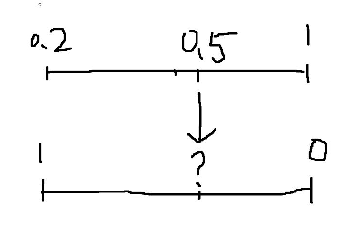

# About

这是一个有界比例尺工程，可以类比为一阶函数。



​	如上图所示，有两把尺子，但是尺子的刻度不一样，且方向也不一样（可能从大到小，也可能从小到大）。现在知道两把尺子的最大最小刻度和方向，这时候输入任意一把尺子的刻度，能够得到另一把尺子对应的刻度。如根据第一把尺子的0.5求第二把尺子对应的刻度。若超出尺子的范围，会转为尺子的端点。

Spock测试用例：

```groovy
def "test ruler"() {
    setup:
    def _02 = new BigDecimal(0.2)
    def _05 = new BigDecimal(0.5)

    def positionRuler = RulerFactory.createRuler(BigDecimal.ONE, _02) // 1 - 0.2
    def incomeRuler = RulerFactory.createRuler(BigDecimal.ZERO, BigDecimal.ONE); // 0 - 1
    def scale = new Scale(incomeRuler, positionRuler);

    when:
    // A(0.5) = 5/8 -> b = 5 / 8 = 0.6
    def b = scale.getB(_05).setScale(1, RoundingMode.HALF_UP)

    then:
    b.equals(new BigDecimal(0.6).setScale(1, RoundingMode.HALF_UP))
}
```

# 使用

## Gradle引入该工程

假设A项目需要使用该项目

修改A项目的settings.gradle，添加如下代码，将scale_path替换为scale项目目录

```
include 'scale'
project(':scale').projectDir = file("scale_path")
```

修改A项目的build.gradle

```groovy
dependencies {
    implementation project(":scale") // 引入scale项目
}
```

## Maven引入该工程

修改Scale项目build.gradle文件，配置本地仓库地址

```groovy
publishing {
    repositories {
        maven {
            name = 'localRepo'
            url = "file://${buildDir}/repo" // 修改为本地maven仓库地址
        }
    }
    publications {
        myApp(MavenPublication) {
            groupId = 'com.yqz'
            artifactId = 'scale'
            version = '1.0-SNAPSHOT'

            from components.java
        }
    }
}
```

执行以下命令将jar打包到本地maven仓库

```shell
./gradlew publishToMavenLocal  
```

修改需要引入的项目的pom.xml

```xml
<dependency>
    <groupId>com.yqz</groupId>
    <artifactId>scale</artifactId>
    <version>1.0-SNAPSHOT</version>
</dependency>
```

